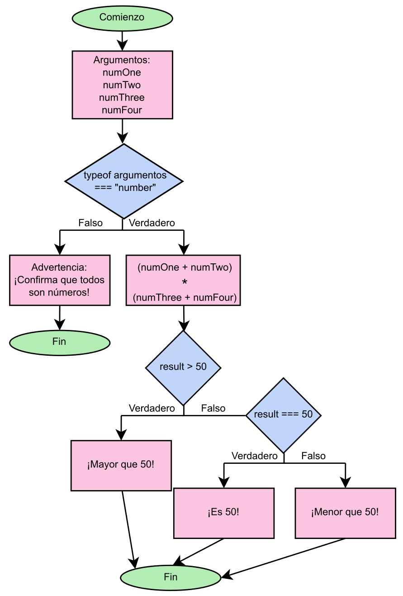

Javascript, conceptos básicos
=======================

Javascript (JS) es un lenguaje de programación orientado a objetos (siglas OOP en inglés); al igual que ocurre con Python,
se basa en el uso y tratamiento de elementos denominados objetos. En JS casi todo puede ser considerado un 
objeto excepto unos casos concretos de tipos de dato «primitivos», que veremos en más detalle en el siguiente apartado.

Lo importante, por ahora, es saber qué hace especial a JS frente a otros tipos de lenguaje de programación. La característica diferenciadora
es que JS puede ser interpretado y ejecutado directamente por los navegadores de internet. Todos los demás lenguajes necesitan un
marco de trabajo concreto y ser procesados, compilados o interpretados por otro *software* para que puedan ser entendidos por
los navegadores. Esto hace que JS sea el lenguaje nativo de los navegadores a la hora de querer ejecutar código sin necesidad de que
este sea «traducido» en un servidor u ordenador.

Aparte de poder ser usado como un OOP, JS también se puede considerar un lenguaje orientado a eventos, lo que significa que puede responder 
a sucesos tales como pinchar con el ratón o cambios dinámicos en la página web en la que estemos. Además, JS tiene una naturaleza asíncrona, básica
en el entorno de un navegador, permitiendo realizar operaciones sin bloquear la ejecución del código. Esto significa que si, por ejemplo, 
tenemos un escuchador de eventos esperando a notar que el ratón pincha un botón, el resto del código puede ejecutarse aunque no se haya pinchado. 
También podría ocurrir que tuviéramos un código tan lento ejecutándose que no querríamos que el resto de funcionalidades no funcionaran hasta
que el primer código acabara de ejecutarse. 

Asimismo, JS destaca por sus estándares abiertos, contribuyendo a su portabilidad y compatibilidad entre diferentes navegadores. La citada estandarización
se basa en la especificación ECMAScript, implementada en la mayoría de navegadores existentes. De igual manera, existe un amplio ecosistema de bibliotecas y
*frameworks* que contribuyen al desarrollo adecuado y robusto de aplicaciones en este lenguaje. 

Tipos de datos en Javascript
-------------------------------

Como se ha mencionado antes, existen varios tipos de datos, los primitivos, que no son objetos *per se*, y los objetos. 

Dentro de los tipos primitivos se incluyen las cadenas de texto (*string*), los números, los booleanos (verdadero o falso), los nulos (carentes de valor, ausencia
intencional de ese valor asignado), los indefinidos (sólo se declara la variable, pero no se le asigna un valor) y símbolo (devuelve un identificador o símbolo único para
una variable o propiedad de un objeto). Veamos un ejemplo de cada tipo:

.. code-block:: javascript

    var cadena = "Esto es un string";
    var numero = 23;
    var ejemploBooleano = true;
    var nulo = null;
    var indefinido;
    var simbolo = Symbol("Esto es una descripción del símbolo");

En todos los casos hemos puesto ``var nombreVariable`` para declarar la variable y ``= valor`` para asignarle un valor. JS
es inteligente y sabe el tipo de dato que hemos guardado en la variable. Los dos tipos de datos más raros son el indefinido,
ya que lo hemos declarado pero no le hemos pasado valor alguno, y símbolo, que hemos usado una función para transformar
lo que sería una cadena en un mensaje descriptivo de un identificador único. 

Nos queda por poner un ejemplo del tipo objeto, cuya estructura se basa en pares de llave-valor, donde cada llave es una propiedad del objeto
y el valor que guarda. Así tenemos que:

.. code-block:: javascript

    var ejemploObjeto = {
    llaveUno: "valor 1",
    llaveDos: "valor 2",
    }

Por último nos quedarían los vectores o *arrays*, que son colecciones de otros tipos de datos.

.. code-block:: javascript

    var ejemploArray = [
        cadena, 
        numero, 
        ejemploBooleano,
        nulo,
        indefinido,
        simbolo,
        ejemploObjeto,
    ]

Hemos creado un *array* usando ``[]`` y hemos añadido todas las demás variables como elementos de 
ese *array*. 

Si quisieramos confirmar el tipo de dato de cada variable, y ver que todo está bien hecho, podríamos 
usar el operador ``typeof nuestraVariable`` para verlo. Nota: a partir de ahora veréis que uso de manera
repetida ``console.log()`` para imprimir resultados en la consola.

.. code-block:: javascript

    console.log(typeof cadena)
    console.log(typeof numero)
    console.log(typeof ejemploBooleano)
    console.log(typeof nulo)
    console.log(typeof indefinido)
    console.log(typeof simbolo)
    console.log(typeof ejemploObjeto)
    console.log(typeof ejemploArray)

.. code-block:: output

    Output 
    ------
    string
    number
    boolean
    object
    undefined
    symbol
    object
    object

Todo parece estar bien, excepto el tipo nulo, que por razones históricas e imperfección del operador
typeof nos dice que es un objeto cuando en realidad no lo es, y *array*, que es un tipo de objeto (colección).

Datos de tipo cadena
---------------------

Los datos de tipo cadena aceptan una serie de funciones (métodos), códigos que ante un valor de entrada dan otro de salida,
que permiten realizar diferentes acciones interesantes. Creemos nuestra cadena y veamos las diferentes funciones:

.. code-block:: javascript

    var ejemplo = "Este es mi string the ejemplo"

Algunos ejemplos útiles  de funciones son:

Determinar el tamaño de la cadena, aunque esto es un atributo de esta clase de datos en JS, en otros lenguajes es una función.
Nótese la ausencia de ``()`` detrás del nombre al no ser una función como tal.

.. code-block:: javascript

    console.log(ejemplo.length)

.. code-block:: output

    Output 
    ------
    29

Determinar la letra o carácter que se halla en la posición, o índice, que le proporcionamos.
Recordad que JS es un lenguaje con índices comenzando en 0.

.. code-block:: javascript

    console.log(ejemplo.charAt(0))

.. code-block:: output

    Output 
    ------
    E

Añadir a una cadena otra cadena, es decir, concatenarlas. Es importante ver que esta función no cambia la cadena 
original y mi variable ejemplo sigue teniendo el valor original. Si quisieramos guardar la nueva versión, tendríamos que hacerlo dentro
de una variable.

.. code-block:: javascript

    console.log(ejemplo.concat(" y le añado esto"))

.. code-block:: output

    Output 
    ------
    Este es mi string the ejemplo y le añado esto

De hecho, mirad que pasa si le pedimos que nos diga con la funcióin ``includes()`` si lo que hemos concatenado está
ahí. 

.. code-block:: javascript

    console.log(ejemplo.includes(" y le añado esto"))
    console.log(ejemplo)

.. code-block:: output

    Output 
    ------
    false
    Este es mi string the ejemplo

Nos devuelve ``false`` porque ejemplo no contiene «y le añado esto», tal y como vemos al imprimir
el valor de ejemplo.

Hay muchos más métodos aplicables a los datos de tipo cadena, podéis consultar todos ellos, con ejemplos,
`en este enlace <https://www.w3schools.com/js/js_string_methods.asp>`_.

Condicionales
---------------

Las bases y los fundamentos de los condicionales están explicados en esta guía para :doc:`Python <../m3c5/m3c5_conditionals>`. En JS el 
funcionamiento es muy parecido, sólo cambia la sintaxis para lograr generar los condicionales. Recurriendo al mismo ejemplo 
del casino online que usé en Python, si quisieramos filtrar el acceso de un usuario en base a su edad, podríamos
establecer un condicional que determinara si la edad de esa persona es igual o superior a 18 años. 

.. code-block:: javascript

    var edad = 20

    if (edad < 18) {
        console.log("Acceso denegado")
    } else {
        console.log("Acceso permitido")
    }

.. code-block:: output

    Output 
    ------
    Acceso permitido

Aquí se puede apreciar la sintaxis específica de JS para un condicional ``if (condición) {hacemos algo}``
y la alternativa si no se cumple la condición ``else {si no, ocurre esto otro}``. Las condiciones no tienen por qué
ser binarias, podemos poner condiciones múltiples mediante el uso de ``else if (otra condición) {hacemos esto}``.
En el caso del casino, tal y como indiqué en la guía de Python, podría darse el caso de tener vetada la entrada a ciertas personas cuyos nombres
están en una lista (*array* en JS).

.. code-block:: javascript

    var listaNombres = ["Manuel", "Paco", "Sara"];
    var edad = 20;
    var nombre = "Sara";

    if (edad < 18) {
        console.log("Acceso denegado")
    } else if (listaNombres.includes(nombre)) {
        console.log("Acceso denegado")
    } else {
        console.log("Acceso permitido")
    };

.. code-block:: output

    Output 
    ------
    Acceso denegado

Aquí el nombre ha sido capturado por el ``else if`` al estar incluido en la lista de nombres.

Operador ternario
----------------------

Un operador ternario es una manera adicional de representar las elecciones de un condicional usando una sintaxis más concisa. Sin embargo,
puede llegar a ser más confuso en aquellos casos que no sean simples. La sintaxis es tal que así:

.. code-block:: javascript

    condicion ? expresion_si_es_verdad : expresion_si_es_falso;

Veamos la manera de escribir un operador ternario para nuestro caso de la detección de edad en un casino online.

.. code-block:: javascript

    var edad = 20;

    edad < 18 ? console.log("Acceso denegado") : console.log("Acceso permitido");

.. code-block:: output

    Output 
    ------
    Acceso permitido

Podríamos complicarlo un poco más, aunque no es nada recomendable, puede llevar a confusión. De hecho, en otros lenguajes, como Python, sólo está permitido usar
expresiones ternarias con situaciones de elección binaria, para evitar un uso incorrecto de estos operadores. 

.. code-block:: javascript

    condicion_uno 
        ? condicion_dos 
            ? expresion_si_es_verdad_condicion_dos 
            : si_es_falso_condicion_dos 
        : expresion_si_condicion_uno_falso;

Sería lo mismo que esto:

.. code-block:: javascript

    if (condicion_uno) {
        if (condicion_dos) {
            expresion_si_es_verdad_condicion_dos 
        } else {
            si_es_falso_condicion_dos
        }
    } else {
        expresion_si_condicion_uno_falso
    }

Para el ejemplo del casino tendríamos:

.. code-block:: javascript

    var listaNombres = ["Manuel", "Paco", "Sara"];
    var edad = 20;
    var nombre = "Sara";

    edad >= 18 
    ? listaNombres.includes(nombre)
        ? console.log("Acceso denegado") 
        : console.log("Acceso permitido") 
    : console.log("Acceso denegado");

.. code-block:: output

    Output 
    ------
    Acceso denegado

Comprobamos primero que la edad sea superior o igual a 18 años. Después, miramos si su nombre está en la lista
de prohibición, en caso de estarlo se le denegará el acceso. Si la edad fuera menor de 18 años, saltaríamos
a la expresión activada si el primer condicional es falso.
Repito que esto no es recomendable, siempre es mejor que se entienda bien el funcionamiento del código;
debe primar la legibilidad al ahorro de líneas de código.

Funciones
---------------

Las funciones son instrucciones que permiten transformar un *input* en un *output*. La lógica detrás de 
la creación de funciones está explicada en detalle en mi guía de :doc:`Python <../m3c5/m3c5_functions>`. Aquí se explicará la sintaxis 
específica de JS. Usaré el mismo caso de la caja mágica en la que meter un pañuelo lo transforma en una paloma
y cualquier otra cosa se queda igual. 

.. code-block:: javascript

    var cosaUno = "pañuelo";
    var cosaDos = "otra cosa";

    function cajaMagica (cosa) {
        if (cosa.toLowerCase() === "pañuelo") {
            console.log("paloma")
        } else {
            console.log(cosa.toLowerCase())
        }
    };

    cajaMagica(cosaUno);
    cajaMagica(cosaDos);

.. code-block:: output

    Output 
    ------
    paloma
    otra cosa

En este caso hemos declarado una función, poníendole un nombre ``cajaMagica``, y hemos insertado dentro un condicional para que analice el texto dentro
del argumento ``cosa``. 

Existe otra manera de crear una función, generar una expresión de función anónima sin declaración de su nombre. Para lograr esto, debemos 
guardar la función anónima dentro de una variable (la haremos constante, declarándola con ``const``, para que no se pueda modificar), que sí que tendrá nombre.

.. code-block:: javascript

    var cosaUno = "pañuelo";
    var cosaDos = "otra cosa";

    const cajaMagica = function (cosa) {
        if (cosa.toLowerCase() === "pañuelo") {
            console.log("paloma")
        } else {
            console.log(cosa.toLowerCase())
        }
    };

    cajaMagica(cosaUno);
    cajaMagica(cosaDos);

.. code-block:: output

    Output 
    ------
    paloma
    otra cosa

Como veis es lo mismo, simplemente con la declaración tenemos una función con nombre y en la expresión de función tenemos una variable con una función dentro.
El que usemos un tipo u otro dependerá del ámbito en el que queramos usar la función, el cómo queramos usarla (es más fácil pasar una función como argumento
de otra si está guardada en una variable), de cuestiones estilísticas, y del *hoisting* de la declaración (con una declaración de función, la 
función se puede usar antes de declararla, mientras que con las expresiones de función no).

La palabra clave *this*
-----------------------

La palabra *this* se utiliza en JS para hacer referencia a una instancia en concreto dentro de un entorno, objeto o función en la que se encuentre un elemento que
queremos usar. Hay muchas situaciones en las que puede ser necesario referirse al propio ámbito de un elemento en JS. A continuación 
expongo dos ejemplos de su utilidad:

Tenemos que hacer que al pinchar en un boton de una página web este se desactive, para no poder pulsarlo muchas
veces seguidas y saturar el sistema u obtener respuestas inesperadas: 

.. code-block:: javascript

    const miBoton = document.getElementById("miBoton");

    miBoton.addEventListener("click", function() {
        this.disabled = true;
    });

Tenemos un objeto con un nombre como propiedad y queremos poder mostrar ese nombre con una función declarada
dentro del objeto:

.. code-block:: javascript

    const persona = {
        nombre: "Endika",
        mostrarNombre: function () {
            console.log(this.nombre);
        }
    }

    persona.mostrarNombre();

Aquí el *this* nos señala a la propiedad interna del objeto llamada nombre.

Ejercicio propuesto
-------------------------------

Con todos los conocimientos adquiridos, podemos intentar resolver el ejercicio que nos han mandado. Dice así: «Cree una función JS que incluya 
4 argumentos. Suma los dos primeros argumentos, luego los dos segundos y multiplícalos. 
Si el número creado es mayor que 50, registre la consola "¡El número es mayor que 50!". 
Si es más pequeño, registre la consola "¡El número es inferior a 50!"»

Vamos a desgranar paso a paso lo que vamos a hacer para lograr crear la función que nos solicitan. Primero vamos a declarar la función y pasarle cuatro
argumentos.

.. code-block:: javascript

    var numOne = 2;
    var numTwo = 3;
    var numThree = 4;
    var numFour = 5;

    function mathOperation (numOne, numTwo, numThree, numFour) {
        console.log(numOne);
        console.log(numTwo);
        console.log(numThree);
        console.log(numFour);
    };

    mathOperation(numOne, numTwo, numThree, numFour);

.. code-block:: output

    Output 
    ------
    2
    3
    4
    5

Hemos imprimido los cuatro números, pero podríamos haber confirmado que fueran números de la siguiente manera:

.. code-block:: javascript

    var numOne = 2;
    var numTwo = 3;
    var numThree = 4;
    var numFour = 5;

    function mathOperation (numOne, numTwo, numThree, numFour) {
        function checkNumbers(numOne, numTwo, numThree, numFour) {
            if (typeof numOne === "number"
                && typeof numTwo === "number"
                && typeof numThree === "number"
                && typeof numFour === "number") {
                    return true;
                }
        };

        if (checkNumbers (numOne, numTwo, numThree, numFour)) {
            console.log("Son números")
        } else {
            console.log("No son números")
        }
    };

    mathOperation(numOne, numTwo, numThree, numFour);

.. code-block:: output

    Output 
    ------
    Son números

Hemos creados una función dentro de ``mathOperation``, llamada ``checkNumbers``, para devolver un booleano true si los cuatro argumentos son
números. Debajo hemos puesto un condicional que imprime ``Son números`` si checkNumbers devuelve verdadero, si no, alguno no es un número.
Ahora nos quedaría, dentro de la condición de que todos sean números, hacer el cálculo pedido.

.. code-block:: javascript

    var numOne = 2;
    var numTwo = 3;
    var numThree = 4;
    var numFour = 5;

    function mathOperation (numOne, numTwo, numThree, numFour) {
        function checkNumbers(numOne, numTwo, numThree, numFour) {
            if (typeof numOne === "number"
                && typeof numTwo === "number"
                && typeof numThree === "number"
                && typeof numFour === "number") {
                    return true;
                }
        };
        
        if (checkNumbers (numOne, numTwo, numThree, numFour)) {
            let result = (numOne + numTwo) * (numThree + numFour);
            console.log(result)
        } else {
            console.log("Confirma que todos son números")
        }
    };

    mathOperation(numOne, numTwo, numThree, numFour);

.. code-block:: output

    Output 
    ------
    45

Pero no nos han mandado imprimir el número, nos han pedido que miremos con un condicional si el resultado es superior o inferior a 50,
creo que convendría añadir otra condición si el valor es 50 (para evitar que else incluya a 50, o podríamos poner un ``else if``). 

.. code-block:: javascript

    var numOne = 2;
    var numTwo = 3;
    var numThree = 4;
    var numFour = 5;

    function mathOperation (numOne, numTwo, numThree, numFour) {
        function checkNumbers(numOne, numTwo, numThree, numFour) {
            if (typeof numOne === "number"
                && typeof numTwo === "number"
                && typeof numThree === "number"
                && typeof numFour === "number") {
                    return true;
                }
        };
        
        if (checkNumbers (numOne, numTwo, numThree, numFour)) {
            let result = (numOne + numTwo) * (numThree + numFour);
            if (result > 50) {
                console.log("¡El número es mayor que 50!")
            } else if (result === 50) {
                console.log("¡El número es 50!")
            }
            else {
                console.log("¡El número es inferior a 50!")
            };
        } else {
            console.log("Confirma que todos son números")
        }
    };

    mathOperation(numOne, numTwo, numThree, numFour);

.. code-block:: output

    Output 
    ------
    ¡El número es inferior a 50!

¡Listo! 
Si alguno de los argumentos no fuera un número, 
la consola nos indicaría que confirmáramos que todos fueran números.

Dado que una imagen vale más que mil palabras, aquí dejo un diagrama explicando nuestra función.

